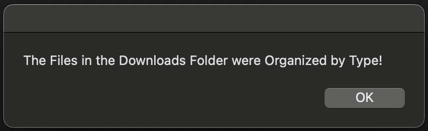

# Simply Organize 'Downloads' Folder

We’ve all been there! You download a file, think you'll remember where you put it, and suddenly your Downloads folder looks like a digital junkyard 😄 This app is here to rescue you from the chaos and restore order to your digital life!

It helps users efficiently manage their Downloads folder by automatically sorting files into subfolders based on their types. This simple tool makes it easier to find what you need, saving you time and effort!


## Features
✨ Easy to use—just double-click to run!<br> 
✨ Automatically organizes files in the Downloads folder by type.<br>
✨ Creates a separate folder for each file extension.<br>
✨ Notifies the user when the organization is complete.<br>


## How to Use

### Step 1: Download the Application
1. Clone or download this repository to your computer.
```bash
cd <repo-directory>
git clone <repo-url>
```
### Step 2: Place the Files
1. Ensure that both `Organize Downloads.app` and `organize_downloads.sh` are in the same directory (e.g., a folder on your Desktop).

### Step 3: Run the Application
1. Double-click on the `Organize Downloads.app`. The application will run and organize your Downloads folder automatically.


2. You will receive a MAC notification when the organization is complete.


4. Sample result


### ⚠️ Important Notes 
- Ensure that you have write permissions for the Downloads folder, as the application will need to move files.
- The application does not delete any files; it simply organizes them into folders based on their types.
- Existing Folders are not reorganized, just the files outside a folder.

## License
This project is licensed under the MIT License. See the [LICENSE](LICENSE) file for details.
